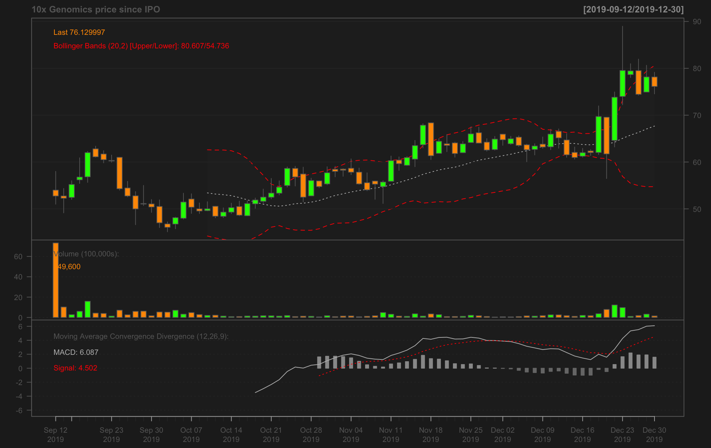
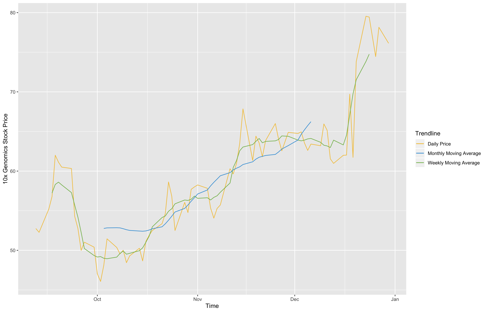
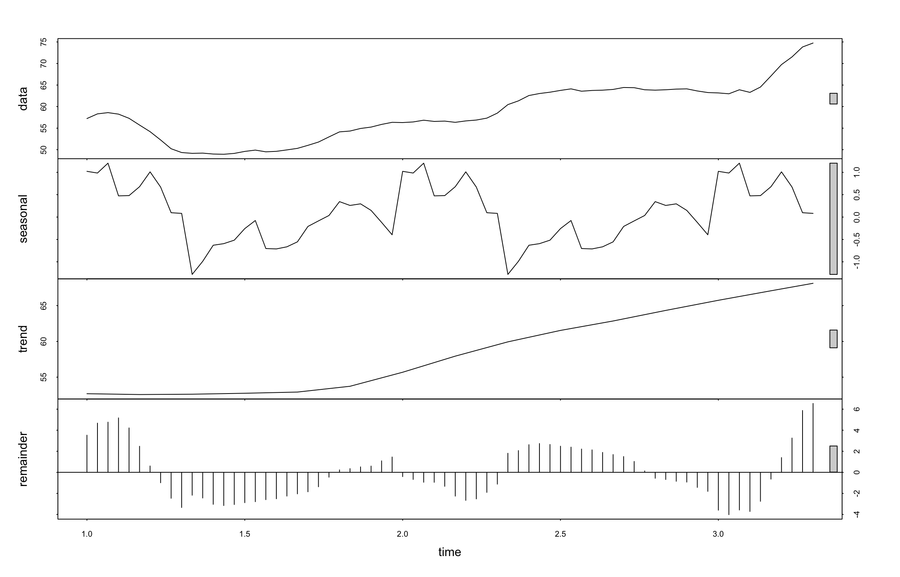

So it turns out there's some pretty easy-to-use and helpful R packages for analyzing and visualizing financial data. I might update this later to include some material on ARIMA and other forecasting methods but for now here's a quick overview of 3 plots I was able to figure out in a few minutes:

```
library(forecast)
library(ggplot2)
library(quantmod)
library(tseries)
```
We'll start by fetching 10x Genomic's stock pricing since its IPO on September 12, 2019 from Yahoo (Google stopped serving finance data in 2018). The `quantmod` package provides a clear-cut workflow for importing these data in tidy-friendly format.

The default `chartSeries()` plot from `quantmod` is aesthetically pleasing and informative (IMHO). You can read about moving average convergence divergence [here](https://www.investopedia.com/terms/m/macd.asp) and [here](https://en.wikipedia.org/wiki/MACD), and Bollinger bands [here](https://www.investopedia.com/terms/b/bollingerbands.asp) and [here](https://en.wikipedia.org/wiki/Bollinger_Bands).
```
txg.tkr = getSymbols("TXG", from=as.Date("2019-09-12"), to=as.Date("2019-12-31"), auto.assign=FALSE)
chartSeries(txg.tkr, name='10x Genomics price since IPO')
addMACD() # Add moving average convergence divergence
addBBands() # Add Bollinger bands
```


Next, here's a figure looking at daily, weekly, and monthly averages of $TXG over time:

```
df = data.frame(date = index(txg.tkr), txg.tkr, row.names=NULL) # Make a tidy DF
df$ma7 = ma(df$TXG.Adjusted, order=7) # Calculate the weekly
df$ma30 = ma(df$TXG.Adjusted, order=30)
ggplot() +
    geom_line(data = df, aes(x = df$date, y = df$TXG.Adjusted, color = "Daily Price")) +
    geom_line(data = df, aes(x = df$date, y = df$ma7,   color = "Weekly Moving Average"))  +
    geom_line(data = df, aes(x = df$date, y = df$ma30, color = "Monthly Moving Average"))  +
    ylab('10x Genomics Stock Price') +
    xlab('Time') + 
    scale_color_manual(values = c("#f3c548", "#42a0da", "#84bb5b")) + 
    labs(color = 'Trendline')
```


Finally, we can use the `stl()` function from `stats` to do time series decomposition (breaking time series data down into components explained by seasonality/periodicity in relation to increase or decrease in price over time). First, let's test for seasonality/whether $TXG has been stationary over the first few months of pricing:
```
adf.test(price_ma, alternative = "stationary")
```
The first few months of $TXG's trading indicate that we do not have to adjust for seasonality:
```
	Augmented Dickey-Fuller Test

data:  price_ma
Dickey-Fuller = -3.4664, Lag order = 4, p-value = 0.05233
alternative hypothesis: stationary
```
Let's take a look at what time series decomposition shows us:
```
price_ma = ts(na.omit(df$ma7), frequency=30)
decomp = stl(price_ma, s.window="periodic", robust = TRUE)
plot(decomp)
```


As we can see, there doesn't seem to be readily apparent periodicity in the stock price of $TXG trades from 12 September 2019 to 31 December 2019.
